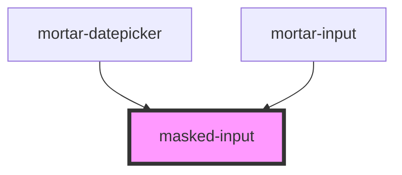

# masked-input

<!-- Auto Generated Below -->

## Properties

| Property       | Attribute      | Description | Type                                                                                                 | Default     |
| -------------- | -------------- | ----------- | ---------------------------------------------------------------------------------------------------- | ----------- |
| `elementclass` | `elementclass` |             | `string`                                                                                             | `''`        |
| `inputmode`    | `inputmode`    |             | `string`                                                                                             | `'text'`    |
| `inputtype`    | `inputtype`    |             | `string`                                                                                             | `'text'`    |
| `name`         | `name`         |             | `string`                                                                                             | `'input'`   |
| `options`      | --             |             | `{ mask: String[]; pipe: Function; guide: Boolean; keepCharPositions: Boolean; showMask: Boolean; }` | `undefined` |
| `pattern`      | `pattern`      |             | `string`                                                                                             | `''`        |
| `placeholder`  | `placeholder`  |             | `string`                                                                                             | `''`        |
| `required`     | `required`     |             | `boolean`                                                                                            | `false`     |
| `type`         | `type`         |             | `string`                                                                                             | `''`        |
| `value`        | `value`        |             | `string`                                                                                             | `''`        |

## Events

| Event         | Description | Type                  |
| ------------- | ----------- | --------------------- |
| `inputChange` |             | `CustomEvent<string>` |
| `maskedBlur`  |             | `CustomEvent<string>` |

## Dependencies

### Used by

 - [mortar-datepicker](../mortar-datepicker)
 - [mortar-input](../mortar-input)

### Graph

----------------------------------------------

