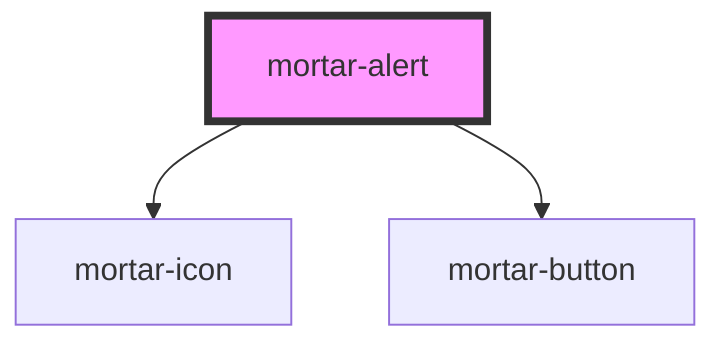

# mortar-alert

```example
<div>
  <p>Add an open attribute to the alert in the code below to see it open</p>
  <mortar-alert>
    <p slot="headline">
      Demo Success
    </p>
    <p slot="copy">
      The alert has opened successfully.
    </p>
  </mortar-alert>
</div>
```


<!-- Auto Generated Below -->


## Properties

| Property   | Attribute  | Description | Type      | Default          |
| ---------- | ---------- | ----------- | --------- | ---------------- |
| `btnkind`  | `btnkind`  |             | `string`  | `'text'`         |
| `btnlabel` | `btnlabel` |             | `string`  | `'Close Window'` |
| `headline` | `headline` |             | `string`  | `''`             |
| `kind`     | `kind`     |             | `string`  | `'success'`      |
| `open`     | `open`     |             | `boolean` | `false`          |
| `overlay`  | `overlay`  |             | `boolean` | `true`           |


## Dependencies

### Depends on

- [mortar-icon](../mortar-icon)
- [mortar-button](../mortar-button)

### Graph


----------------------------------------------


