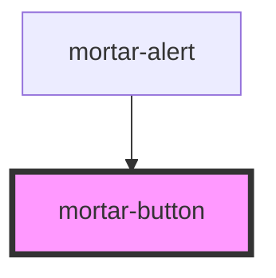

# mortar-button

A button component for the apartments mortar design system.

### Button Kinds

For the style type of buttons use the prop of kind, the following are available kinds of buttons:

##### Primary

```example
<mortar-button kind='primary' size='md'>Button Label</mortar-button>
```

##### Secondary

```example
<mortar-button kind='secondary' size='md'>Button Label</mortar-button>
```

##### Destructive

```example
<mortar-button kind='destructive' size='md'>Button Label</mortar-button>
```

##### Text

```example
<mortar-button kind='text' size='md'>Button Label</mortar-button>
```

### Button Sizes

Buttons also have different sizes available using the size prop. 

##### Small

```example
<mortar-button kind='secondary' size='sm'>Button Label</mortar-button>
```

##### Medium

```example
<mortar-button kind='secondary' size='md'>Button Label</mortar-button>
```

##### Large

```example
<mortar-button kind='secondary' size='lg'>Button Label</mortar-button>
```

### Link

If you are needing a link style as a button use the href prop. You can also set the target type as well. 

```example
<mortar-button kind='secondary' size='md' href='http://apartments.com' target='_blank'>Button Label</mortar-button>
```

### Disabled

You can also control if the button is disabled.

```example
<mortar-button kind='secondary' size='md' disabled='true'>Button Label</mortar-button>
```

<!-- Auto Generated Below -->


## Properties

| Property       | Attribute      | Description | Type      | Default     |
| -------------- | -------------- | ----------- | --------- | ----------- |
| `disabled`     | `disabled`     |             | `boolean` | `false`     |
| `elementclass` | `elementclass` |             | `string`  | `''`        |
| `href`         | `href`         |             | `string`  | `''`        |
| `kind`         | `kind`         |             | `string`  | `'primary'` |
| `size`         | `size`         |             | `string`  | `'md'`      |
| `target`       | `target`       |             | `string`  | `'_self'`   |


## Dependencies

### Used by

 - [mortar-alert](../mortar-alert)

### Graph


----------------------------------------------


