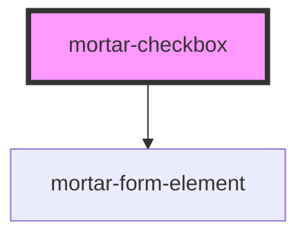

# mortar-checkbox

```example
<mortar-checkbox label="Contact me by">
    <mortar-checkbox-item label="Phone" name="phone"></mortar-checkbox-item>
    <mortar-checkbox-item label="Text" name="text"></mortar-checkbox-item>
    <mortar-checkbox-item label="Email" name="email"></mortar-checkbox-item>
</mortar-checkbox>
```


<!-- Auto Generated Below -->


## Properties

| Property   | Attribute  | Description | Type      | Default |
| ---------- | ---------- | ----------- | --------- | ------- |
| `error`    | `error`    |             | `string`  | `''`    |
| `haserror` | `haserror` |             | `boolean` | `false` |
| `label`    | `label`    |             | `string`  | `''`    |
| `name`     | `name`     |             | `string`  | `''`    |


## Dependencies

### Depends on

- [mortar-form-element](../mortar-form-element)

### Graph


----------------------------------------------


