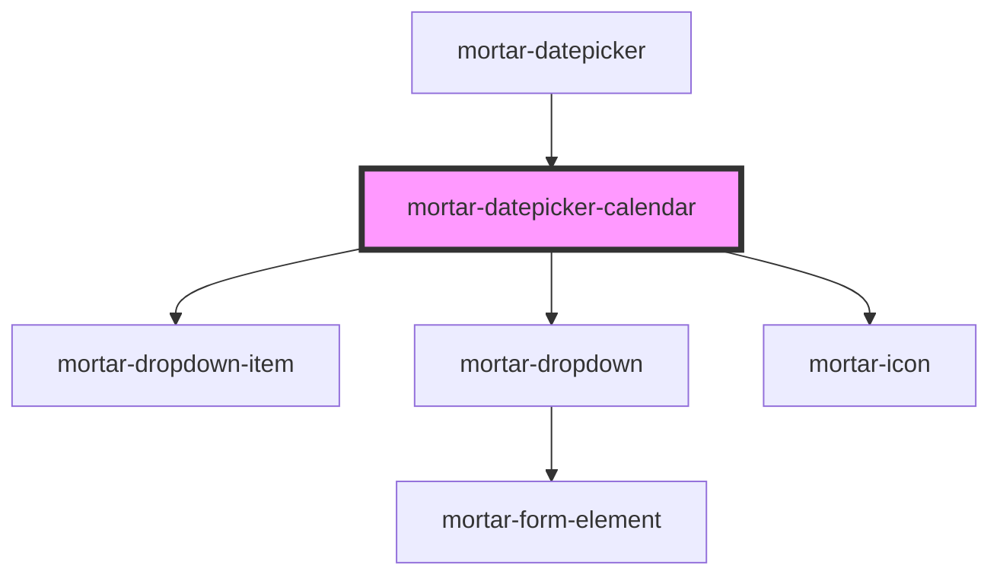

# mortar-datepicker-calendar

```example
<mortar-datepicker-calendar embed="true" header="false" open="true"></mortar-datepicker-calendar>
```


<!-- Auto Generated Below -->


## Properties

| Property           | Attribute           | Description | Type                                              | Default                                                                                                                      |
| ------------------ | ------------------- | ----------- | ------------------------------------------------- | ---------------------------------------------------------------------------------------------------------------------------- |
| `current`          | --                  |             | `Date`                                            | `undefined`                                                                                                                  |
| `customClass`      | --                  |             | `(_year: any, _month: any, _date: any) => string` | `(_year, _month, _date) => ''`                                                                                               |
| `days`             | --                  |             | `string[]`                                        | `['S', 'M', 'T', 'W', 'R', 'F', 'S']`                                                                                        |
| `embed`            | `embed`             |             | `boolean`                                         | `false`                                                                                                                      |
| `focused`          | `focused`           |             | `boolean`                                         | `false`                                                                                                                      |
| `header`           | `header`            |             | `boolean`                                         | `true`                                                                                                                       |
| `highlight`        | `highlight`         |             | `number`                                          | `-1`                                                                                                                         |
| `maxDate`          | --                  |             | `Date`                                            | `undefined`                                                                                                                  |
| `minDate`          | --                  |             | `Date`                                            | `undefined`                                                                                                                  |
| `monthPlaceholder` | `month-placeholder` |             | `string`                                          | `'Month'`                                                                                                                    |
| `months`           | --                  |             | `string[]`                                        | `['January', 'February', 'March', 'April', 'May', 'June', 'July', 'August', 'September', 'October', 'November', 'December']` |
| `open`             | `open`              |             | `boolean`                                         | `false`                                                                                                                      |
| `selected`         | --                  |             | `Date`                                            | `undefined`                                                                                                                  |
| `yearPlaceholder`  | `year-placeholder`  |             | `string`                                          | `'Year'`                                                                                                                     |


## Events

| Event            | Description | Type                         |
| ---------------- | ----------- | ---------------------------- |
| `clearDate`      |             | `CustomEvent<void>`          |
| `clickDate`      |             | `CustomEvent<Date>`          |
| `keyboardExit`   |             | `CustomEvent<void>`          |
| `keyboardSelect` |             | `CustomEvent<KeyboardEvent>` |
| `selectDate`     |             | `CustomEvent<Date>`          |


## Dependencies

### Used by

 - [mortar-datepicker](../mortar-datepicker)

### Depends on

- [mortar-dropdown-item](../mortar-dropdown-item)
- [mortar-dropdown](../mortar-dropdown)
- [mortar-icon](../mortar-icon)

### Graph


----------------------------------------------


