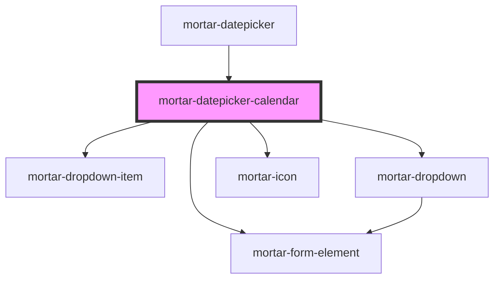

# mortar-datepicker-calendar

```example
<mortar-datepicker-calendar embed header="false" open></mortar-datepicker-calendar>
```


<!-- Auto Generated Below -->


## Properties

| Property            | Attribute           | Description | Type                                              | Default                                                                                                                      |
| ------------------- | ------------------- | ----------- | ------------------------------------------------- | ---------------------------------------------------------------------------------------------------------------------------- |
| `clearlabel`        | `clearlabel`        |             | `string`                                          | `"clear"`                                                                                                                    |
| `current`           | `current`           |             | `Date \| string`                                  | `undefined`                                                                                                                  |
| `customClass`       | --                  |             | `(_year: any, _month: any, _date: any) => string` | `(_year, _month, _date) => ''`                                                                                               |
| `days`              | --                  |             | `string[]`                                        | `['S', 'M', 'T', 'W', 'R', 'F', 'S']`                                                                                        |
| `embed`             | `embed`             |             | `boolean`                                         | `false`                                                                                                                      |
| `error`             | `error`             |             | `string`                                          | `''`                                                                                                                         |
| `haserror`          | `haserror`          |             | `boolean`                                         | `false`                                                                                                                      |
| `header`            | `header`            |             | `boolean`                                         | `true`                                                                                                                       |
| `highlight`         | `highlight`         |             | `number`                                          | `-1`                                                                                                                         |
| `label`             | `label`             |             | `string`                                          | `''`                                                                                                                         |
| `max`               | `max`               |             | `Date \| string`                                  | `new Date(2100, 11, 31)`                                                                                                     |
| `min`               | `min`               |             | `Date \| string`                                  | `new Date(1900, 0, 1)`                                                                                                       |
| `monthlabel`        | `monthlabel`        |             | `string`                                          | `'select month'`                                                                                                             |
| `monthplaceholder`  | `monthplaceholder`  |             | `string`                                          | `'Month'`                                                                                                                    |
| `months`            | --                  |             | `string[]`                                        | `['January', 'February', 'March', 'April', 'May', 'June', 'July', 'August', 'September', 'October', 'November', 'December']` |
| `monthselectlabel`  | `monthselectlabel`  |             | `string`                                          | `"choose month"`                                                                                                             |
| `name`              | `name`              |             | `string`                                          | `'calendar'`                                                                                                                 |
| `nextlabel`         | `nextlabel`         |             | `string`                                          | `"next month"`                                                                                                               |
| `open`              | `open`              |             | `boolean`                                         | `false`                                                                                                                      |
| `previouslabel`     | `previouslabel`     |             | `string`                                          | `"previous month"`                                                                                                           |
| `screenreaderlabel` | `screenreaderlabel` |             | `boolean`                                         | `false`                                                                                                                      |
| `selected`          | `selected`          |             | `Date \| string`                                  | `undefined`                                                                                                                  |
| `yearlabel`         | `yearlabel`         |             | `string`                                          | `'select year'`                                                                                                              |
| `yearplaceholder`   | `yearplaceholder`   |             | `string`                                          | `'Year'`                                                                                                                     |
| `yearselectlabel`   | `yearselectlabel`   |             | `string`                                          | `"choose year"`                                                                                                              |


## Events

| Event            | Description | Type                         |
| ---------------- | ----------- | ---------------------------- |
| `clearDate`      |             | `CustomEvent<void>`          |
| `clickDate`      |             | `CustomEvent<Date>`          |
| `keyboardExit`   |             | `CustomEvent<void>`          |
| `keyboardSelect` |             | `CustomEvent<KeyboardEvent>` |
| `selectDate`     |             | `CustomEvent<Date>`          |


## Dependencies

### Used by

 - [mortar-datepicker](../mortar-datepicker)

### Depends on

- [mortar-dropdown-item](../mortar-dropdown-item)
- [mortar-form-element](../mortar-form-element)
- [mortar-dropdown](../mortar-dropdown)
- [mortar-icon](../mortar-icon)

### Graph


----------------------------------------------


