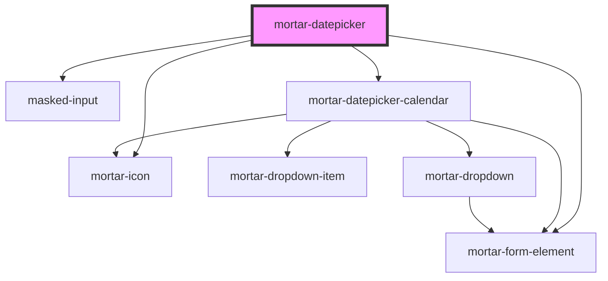

# mortar-datepicker

```example
<mortar-datepicker label="Start Date" placeholder="mm/dd/yyyy"></mortar-datepicker>
```


<!-- Auto Generated Below -->


## Properties

| Property            | Attribute           | Description | Type                    | Default                                                                                                                                                                                                                                                           |
| ------------------- | ------------------- | ----------- | ----------------------- | ----------------------------------------------------------------------------------------------------------------------------------------------------------------------------------------------------------------------------------------------------------------- |
| `clearlabel`        | `clearlabel`        |             | `string`                | `"clear"`                                                                                                                                                                                                                                                         |
| `dateToString`      | --                  |             | `(date: any) => string` | `(date) => {     if (!date) return '';      let nd = new Date(date);      const m = nd.getMonth() + 1;     const ms = (m >= 10) ? m : '0'+m;     const d = nd.getDate();     const ds = (d >= 10) ? d : '0'+d;     return `${ms}/${ds}/${nd.getFullYear()}`;   }` |
| `days`              | --                  |             | `string[]`              | `['S', 'M', 'T', 'W', 'R', 'F', 'S']`                                                                                                                                                                                                                             |
| `disabled`          | `disabled`          |             | `boolean`               | `false`                                                                                                                                                                                                                                                           |
| `error`             | `error`             |             | `string`                | `''`                                                                                                                                                                                                                                                              |
| `haserror`          | `haserror`          |             | `boolean`               | `false`                                                                                                                                                                                                                                                           |
| `header`            | `header`            |             | `boolean`               | `true`                                                                                                                                                                                                                                                            |
| `label`             | `label`             |             | `string`                | `''`                                                                                                                                                                                                                                                              |
| `mask`              | `mask`              |             | `string`                | `'Date'`                                                                                                                                                                                                                                                          |
| `max`               | `max`               |             | `Date \| string`        | `new Date(2100, 11, 31)`                                                                                                                                                                                                                                          |
| `min`               | `min`               |             | `Date \| string`        | `new Date(1900, 0, 1)`                                                                                                                                                                                                                                            |
| `monthplaceholder`  | `monthplaceholder`  |             | `string`                | `'Month'`                                                                                                                                                                                                                                                         |
| `months`            | --                  |             | `string[]`              | `['January', 'February', 'March', 'April', 'May', 'June', 'July', 'August', 'September', 'October', 'November', 'December']`                                                                                                                                      |
| `monthselectlabel`  | `monthselectlabel`  |             | `string`                | `"choose month"`                                                                                                                                                                                                                                                  |
| `name`              | `name`              |             | `string`                | `'datepicker'`                                                                                                                                                                                                                                                    |
| `nextlabel`         | `nextlabel`         |             | `string`                | `"next month"`                                                                                                                                                                                                                                                    |
| `open`              | `open`              |             | `boolean`               | `false`                                                                                                                                                                                                                                                           |
| `placeholder`       | `placeholder`       |             | `string`                | `"mm/dd/yyyy"`                                                                                                                                                                                                                                                    |
| `previouslabel`     | `previouslabel`     |             | `string`                | `"previous month"`                                                                                                                                                                                                                                                |
| `required`          | `required`          |             | `boolean`               | `false`                                                                                                                                                                                                                                                           |
| `screenreaderlabel` | `screenreaderlabel` |             | `boolean`               | `false`                                                                                                                                                                                                                                                           |
| `togglelabel`       | --                  |             | `(date: any) => string` | `(date) => {     if (!date) {       return 'Choose Date';     } else {       return `Choose Date, Selected Date is ${new Date(date).toDateString()}`     }   }`                                                                                                   |
| `value`             | `value`             |             | `Date \| string`        | `undefined`                                                                                                                                                                                                                                                       |
| `valueString`       | `value-string`      |             | `string`                | `''`                                                                                                                                                                                                                                                              |
| `yearplaceholder`   | `yearplaceholder`   |             | `string`                | `'Year'`                                                                                                                                                                                                                                                          |
| `yearselectlabel`   | `yearselectlabel`   |             | `string`                | `"choose year"`                                                                                                                                                                                                                                                   |


## Events

| Event            | Description | Type                |
| ---------------- | ----------- | ------------------- |
| `clearDate`      |             | `CustomEvent<void>` |
| `dateOutOfRange` |             | `CustomEvent<Date>` |
| `inputChange`    |             | `CustomEvent<Date>` |
| `selectDate`     |             | `CustomEvent<Date>` |


## Dependencies

### Depends on

- [mortar-form-element](../mortar-form-element)
- [masked-input](../masked-input)
- [mortar-icon](../mortar-icon)
- [mortar-datepicker-calendar](../mortar-datepicker-calendar)

### Graph


----------------------------------------------


