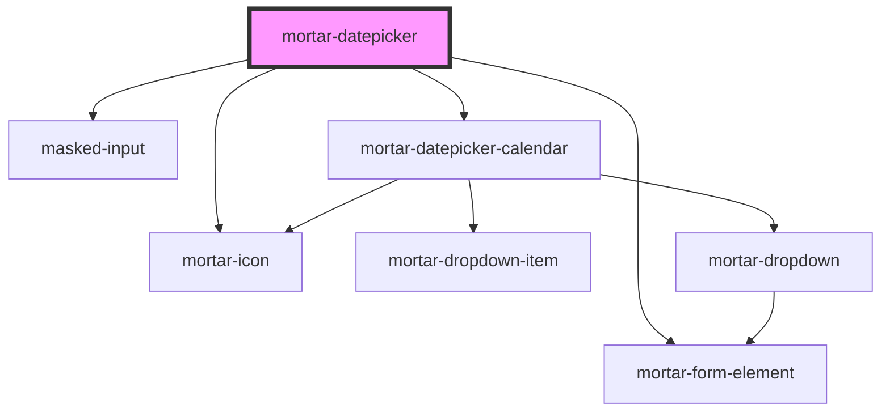

# mortar-datepicker

```example
<mortar-datepicker label="Start Date" placeholder="mm/dd/yyyy"></mortar-datepicker>
```


<!-- Auto Generated Below -->


## Properties

| Property       | Attribute      | Description | Type                    | Default                                                                                                                                                                                                                                   |
| -------------- | -------------- | ----------- | ----------------------- | ----------------------------------------------------------------------------------------------------------------------------------------------------------------------------------------------------------------------------------------- |
| `dateToString` | --             |             | `(date: any) => string` | `(date) => {     if (!date) return '';      const m = date.getMonth() + 1;     const ms = (m >= 10) ? m : '0'+m;     const d = date.getDate();     const ds = (d >= 10) ? d : '0'+d;     return `${ms}/${ds}/${date.getFullYear()}`;   }` |
| `disabled`     | `disabled`     |             | `boolean`               | `false`                                                                                                                                                                                                                                   |
| `error`        | `error`        |             | `string`                | `''`                                                                                                                                                                                                                                      |
| `haserror`     | `haserror`     |             | `boolean`               | `false`                                                                                                                                                                                                                                   |
| `header`       | `header`       |             | `boolean`               | `true`                                                                                                                                                                                                                                    |
| `label`        | `label`        |             | `string`                | `''`                                                                                                                                                                                                                                      |
| `mask`         | `mask`         |             | `string`                | `'Date'`                                                                                                                                                                                                                                  |
| `max`          | --             |             | `Date`                  | `new Date(2100, 11, 31)`                                                                                                                                                                                                                  |
| `min`          | --             |             | `Date`                  | `new Date(1900, 0, 1)`                                                                                                                                                                                                                    |
| `name`         | `name`         |             | `string`                | `''`                                                                                                                                                                                                                                      |
| `open`         | `open`         |             | `boolean`               | `false`                                                                                                                                                                                                                                   |
| `placeholder`  | `placeholder`  |             | `string`                | `"mm/dd/yyyy"`                                                                                                                                                                                                                            |
| `required`     | `required`     |             | `boolean`               | `true`                                                                                                                                                                                                                                    |
| `value`        | --             |             | `Date`                  | `undefined`                                                                                                                                                                                                                               |
| `valueString`  | `value-string` |             | `string`                | `''`                                                                                                                                                                                                                                      |


## Events

| Event            | Description | Type                |
| ---------------- | ----------- | ------------------- |
| `clearDate`      |             | `CustomEvent<void>` |
| `dateOutOfRange` |             | `CustomEvent<Date>` |
| `inputChange`    |             | `CustomEvent<Date>` |
| `selectDate`     |             | `CustomEvent<Date>` |


## Dependencies

### Depends on

- [mortar-form-element](../mortar-form-element)
- [masked-input](../masked-input)
- [mortar-icon](../mortar-icon)
- [mortar-datepicker-calendar](../mortar-datepicker-calendar)

### Graph


----------------------------------------------


