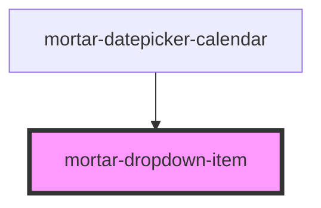

# mortar-dropdown-item

```example
<mortar-dropdown label="Select Number" placeholder="Please select a value">
    <mortar-dropdown-item value="1" label="One"></mortar-dropdown-item>
    <mortar-dropdown-item value="2" label="Two" selected></mortar-dropdown-item>
    <mortar-dropdown-item value="3" label="Three"></mortar-dropdown-item>
    <mortar-dropdown-item value="4" label="Four" disabled></mortar-dropdown-item>
    <mortar-dropdown-item value="5" label="Five"></mortar-dropdown-item>
</mortar-dropdown>
```

<!-- Auto Generated Below -->


## Properties

| Property      | Attribute     | Description | Type      | Default |
| ------------- | ------------- | ----------- | --------- | ------- |
| `disabled`    | `disabled`    |             | `boolean` | `false` |
| `highlighted` | `highlighted` |             | `boolean` | `false` |
| `label`       | `label`       |             | `string`  | `''`    |
| `selected`    | `selected`    |             | `boolean` | `false` |
| `value`       | `value`       |             | `string`  | `''`    |


## Methods

### `getEl() => Promise<HTMLElement>`


#### Returns

Type: `Promise<HTMLElement>`


## Dependencies

### Used by

 - [mortar-datepicker-calendar](../mortar-datepicker-calendar)

### Graph


----------------------------------------------


