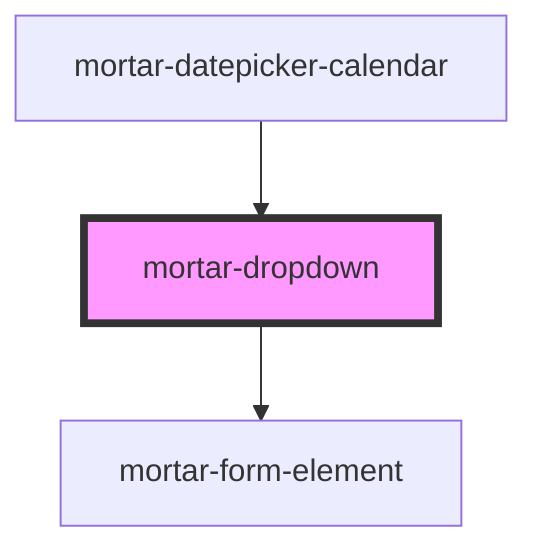

# mortar-dropdown

```example
<mortar-dropdown label="Select Number" placeholder="Please select a value">
    <mortar-dropdown-item value="1" label="One"></mortar-dropdown-item>
    <mortar-dropdown-item value="2" label="Two" selected></mortar-dropdown-item>
    <mortar-dropdown-item value="3" label="Three"></mortar-dropdown-item>
    <mortar-dropdown-item value="4" label="Four" disabled></mortar-dropdown-item>
    <mortar-dropdown-item value="5" label="Five"></mortar-dropdown-item>
</mortar-dropdown>
```

<!-- Auto Generated Below -->


## Properties

| Property      | Attribute     | Description | Type      | Default      |
| ------------- | ------------- | ----------- | --------- | ------------ |
| `disabled`    | `disabled`    |             | `boolean` | `false`      |
| `error`       | `error`       |             | `string`  | `''`         |
| `focused`     | `focused`     |             | `boolean` | `false`      |
| `haserror`    | `haserror`    |             | `boolean` | `false`      |
| `help`        | `help`        |             | `string`  | `''`         |
| `highlight`   | `highlight`   |             | `number`  | `-1`         |
| `label`       | `label`       |             | `string`  | `''`         |
| `name`        | `name`        |             | `string`  | `'dropdown'` |
| `open`        | `open`        |             | `boolean` | `false`      |
| `placeholder` | `placeholder` |             | `string`  | `''`         |
| `required`    | `required`    |             | `boolean` | `false`      |
| `size`        | `size`        |             | `string`  | `'md'`       |
| `value`       | `value`       |             | `string`  | `''`         |


## Events

| Event        | Description | Type                  |
| ------------ | ----------- | --------------------- |
| `itemSelect` |             | `CustomEvent<Object>` |


## Dependencies

### Used by

 - [mortar-datepicker-calendar](../mortar-datepicker-calendar)

### Depends on

- [mortar-form-element](../mortar-form-element)

### Graph


----------------------------------------------


