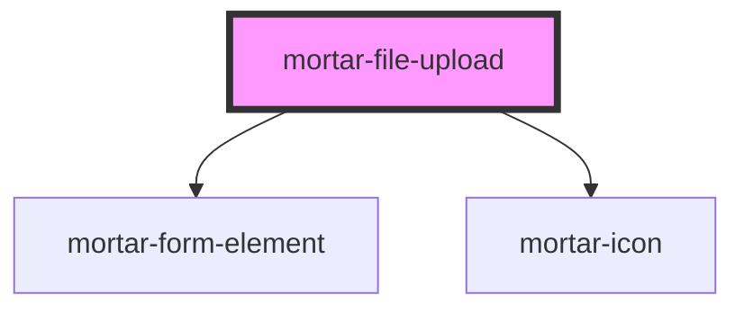

# mortar-file-upload

```example
<mortar-file-upload label="Property Image" text="Upload an Image" descriptor="Select a file to upload"></mortar-file-upload>
```

<!-- Auto Generated Below -->


## Properties

| Property     | Attribute    | Description | Type      | Default         |
| ------------ | ------------ | ----------- | --------- | --------------- |
| `descriptor` | `descriptor` |             | `string`  | `''`            |
| `disabled`   | `disabled`   |             | `boolean` | `false`         |
| `error`      | `error`      |             | `string`  | `''`            |
| `haserror`   | `haserror`   |             | `boolean` | `false`         |
| `label`      | `label`      |             | `string`  | `''`            |
| `multiple`   | `multiple`   |             | `boolean` | `true`          |
| `name`       | `name`       |             | `string`  | `'file-upload'` |
| `required`   | `required`   |             | `boolean` | `false`         |
| `text`       | `text`       |             | `string`  | `''`            |


## Dependencies

### Depends on

- [mortar-form-element](../mortar-form-element)
- [mortar-icon](../mortar-icon)

### Graph


----------------------------------------------


