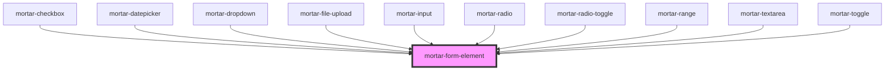

# mortar-form-element

<!-- Auto Generated Below -->

## Properties

| Property       | Attribute      | Description | Type      | Default |
| -------------- | -------------- | ----------- | --------- | ------- |
| `disabled`     | `disabled`     |             | `boolean` | `false` |
| `elementclass` | `elementclass` |             | `string`  | `''`    |
| `error`        | `error`        |             | `string`  | `''`    |
| `haserror`     | `haserror`     |             | `boolean` | `false` |
| `help`         | `help`         |             | `string`  | `''`    |
| `label`        | `label`        |             | `string`  | `''`    |
| `legend`       | `legend`       |             | `string`  | `''`    |
| `legendId`     | `legend-id`    |             | `string`  | `''`    |
| `name`         | `name`         |             | `string`  | `''`    |

## Dependencies

### Used by

 - [mortar-checkbox](../mortar-checkbox)
 - [mortar-datepicker](../mortar-datepicker)
 - [mortar-dropdown](../mortar-dropdown)
 - [mortar-file-upload](../mortar-file-upload)
 - [mortar-input](../mortar-input)
 - [mortar-radio](../mortar-radio)
 - [mortar-radio-toggle](../mortar-radio-toggle)
 - [mortar-range](../mortar-range)
 - [mortar-textarea](../mortar-textarea)
 - [mortar-toggle](../mortar-toggle)

### Graph

----------------------------------------------

