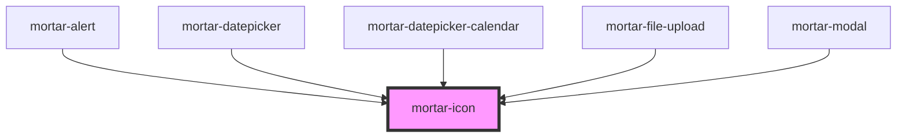

# mortar-icon

```example
<mortar-icon kind="email"></mortar-icon>
```


<!-- Auto Generated Below -->


## Properties

| Property    | Attribute   | Description | Type     | Default |
| ----------- | ----------- | ----------- | -------- | ------- |
| `arialabel` | `arialabel` |             | `string` | `""`    |
| `class`     | `class`     |             | `string` | `""`    |
| `kind`      | `kind`      |             | `string` | `""`    |


## Dependencies

### Used by

 - [mortar-alert](../mortar-alert)
 - [mortar-datepicker](../mortar-datepicker)
 - [mortar-datepicker-calendar](../mortar-datepicker-calendar)
 - [mortar-file-upload](../mortar-file-upload)
 - [mortar-modal](../mortar-modal)

### Graph


----------------------------------------------


