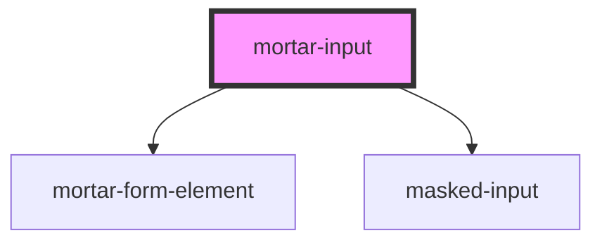

# mortar-input

```example
<mortar-input label="Name" placeholder="Enter Name Here"></mortar-input>
```

<!-- Auto Generated Below -->


## Properties

| Property            | Attribute           | Description | Type      | Default   |
| ------------------- | ------------------- | ----------- | --------- | --------- |
| `disabled`          | `disabled`          |             | `boolean` | `false`   |
| `error`             | `error`             |             | `string`  | `''`      |
| `haserror`          | `haserror`          |             | `boolean` | `false`   |
| `help`              | `help`              |             | `string`  | `''`      |
| `inputmode`         | `inputmode`         |             | `string`  | `'text'`  |
| `label`             | `label`             |             | `string`  | `''`      |
| `mask`              | `mask`              |             | `string`  | `''`      |
| `name`              | `name`              |             | `string`  | `'input'` |
| `pattern`           | `pattern`           |             | `string`  | `''`      |
| `placeholder`       | `placeholder`       |             | `string`  | `''`      |
| `required`          | `required`          |             | `boolean` | `false`   |
| `screenreaderlabel` | `screenreaderlabel` |             | `boolean` | `false`   |
| `size`              | `size`              |             | `string`  | `'md'`    |
| `type`              | `type`              |             | `string`  | `"text"`  |
| `value`             | `value`             |             | `string`  | `''`      |


## Dependencies

### Depends on

- [mortar-form-element](../mortar-form-element)
- [masked-input](../masked-input)

### Graph


----------------------------------------------


