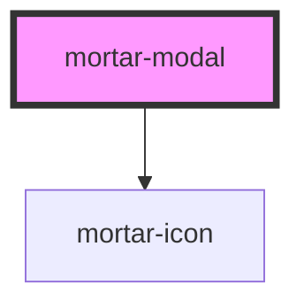

# mortar-modal

```example
<div>
  <p>Add an open attribute to the modal in the code below to see it open</p>
  <mortar-modal>
    <p slot="headline">
      Demo Success
    </p>
    <p slot="copy">
      The modal has opened successfully.
    </p>
    <div slot="actions">
      <mortar-button>Take Action</mortar-button>
      <mortar-button kind="secondary">Cancel</mortar-button>
    </div>
  </mortar-modal>
</div>
```

<!-- Auto Generated Below -->


## Properties

| Property | Attribute | Description | Type      | Default |
| -------- | --------- | ----------- | --------- | ------- |
| `open`   | `open`    |             | `boolean` | `false` |


## Dependencies

### Depends on

- [mortar-icon](../mortar-icon)

### Graph


----------------------------------------------


