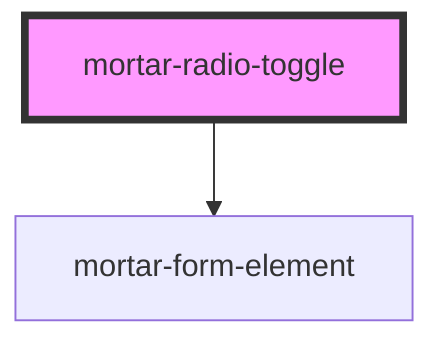

# mortar-radio-toggle

```example
<mortar-radio-toggle>
    <mortar-radio-toggle-item label="One" value="one" name="one" group="numbers"></mortar-radio-toggle-item>
    <mortar-radio-toggle-item label="Two" value="two" name="two" group="numbers"></mortar-radio-toggle-item>
    <mortar-radio-toggle-item label="Three" value="three" name="three" group="numbers"></mortar-radio-toggle-item>
</mortar-radio-toggle>
```

<!-- Auto Generated Below -->


## Properties

| Property   | Attribute  | Description | Type      | Default |
| ---------- | ---------- | ----------- | --------- | ------- |
| `error`    | `error`    |             | `string`  | `''`    |
| `haserror` | `haserror` |             | `boolean` | `false` |
| `label`    | `label`    |             | `string`  | `''`    |


## Dependencies

### Depends on

- [mortar-form-element](../mortar-form-element)

### Graph


----------------------------------------------


