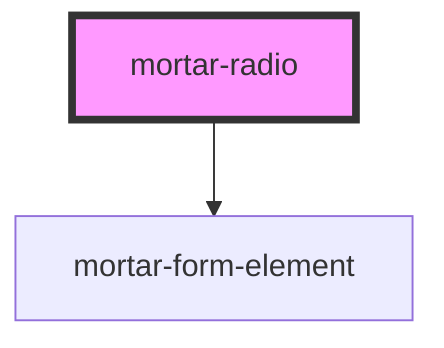

# mortar-radio

```example
<mortar-radio label="Numbers">
    <mortar-radio-item label="One" value="one" name="one" group="numbers"></mortar-radio-item>
    <mortar-radio-item label="Two" value="two" name="two" group="numbers"></mortar-radio-item>
    <mortar-radio-item label="Three" value="three" name="three" group="numbers"></mortar-radio-item>
</mortar-radio>
```

<!-- Auto Generated Below -->


## Properties

| Property            | Attribute           | Description | Type      | Default   |
| ------------------- | ------------------- | ----------- | --------- | --------- |
| `error`             | `error`             |             | `string`  | `''`      |
| `haserror`          | `haserror`          |             | `boolean` | `false`   |
| `label`             | `label`             |             | `string`  | `''`      |
| `name`              | `name`              |             | `string`  | `'radio'` |
| `screenreaderlabel` | `screenreaderlabel` |             | `boolean` | `false`   |


## Dependencies

### Depends on

- [mortar-form-element](../mortar-form-element)

### Graph


----------------------------------------------


