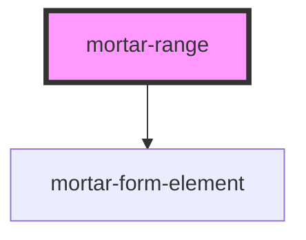

# mortar-range

```example
<mortar-range 
  label="Value Range"
  name="range" 
  minlabel="Min" 
  minplaceholder="Min Amount"
  maxlabel="Max" 
  maxplaceholder="Max Amount"
></mortar-range>
```

<!-- Auto Generated Below -->


## Properties

| Property            | Attribute           | Description | Type      | Default         |
| ------------------- | ------------------- | ----------- | --------- | --------------- |
| `disabled`          | `disabled`          |             | `boolean` | `false`         |
| `error`             | `error`             |             | `string`  | `''`            |
| `haserror`          | `haserror`          |             | `boolean` | `false`         |
| `label`             | `label`             |             | `string`  | `''`            |
| `maxlabel`          | `maxlabel`          |             | `string`  | `''`            |
| `maxplaceholder`    | `maxplaceholder`    |             | `string`  | `''`            |
| `maxrequired`       | `maxrequired`       |             | `boolean` | `false`         |
| `maxvalue`          | `maxvalue`          |             | `string`  | `''`            |
| `minlabel`          | `minlabel`          |             | `string`  | `''`            |
| `minplaceholder`    | `minplaceholder`    |             | `string`  | `''`            |
| `minrequired`       | `minrequired`       |             | `boolean` | `false`         |
| `minvalue`          | `minvalue`          |             | `string`  | `''`            |
| `name`              | `name`              |             | `string`  | `'input-range'` |
| `screenreaderlabel` | `screenreaderlabel` |             | `boolean` | `false`         |
| `size`              | `size`              |             | `string`  | `'md'`          |


## Dependencies

### Depends on

- [mortar-form-element](../mortar-form-element)

### Graph


----------------------------------------------


