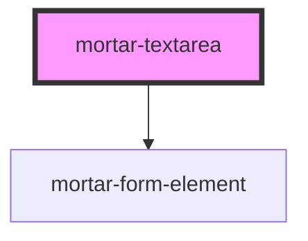

# mortar-textarea

```example
<mortar-textarea label="Message" placeholder="Enter Message" maxlength="500"></mortar-textarea>
```

<!-- Auto Generated Below -->


## Properties

| Property      | Attribute     | Description | Type                      | Default                                                          |
| ------------- | ------------- | ----------- | ------------------------- | ---------------------------------------------------------------- |
| `disabled`    | `disabled`    |             | `boolean`                 | `false`                                                          |
| `error`       | `error`       |             | `string`                  | `''`                                                             |
| `haserror`    | `haserror`    |             | `boolean`                 | `false`                                                          |
| `label`       | `label`       |             | `string`                  | `''`                                                             |
| `maxlength`   | `maxlength`   |             | `string`                  | `''`                                                             |
| `message`     | --            |             | `(amount: any) => string` | `(amount) => {     return `${amount} characters remaining`;   }` |
| `name`        | `name`        |             | `string`                  | `'textarea'`                                                     |
| `placeholder` | `placeholder` |             | `string`                  | `''`                                                             |
| `required`    | `required`    |             | `boolean`                 | `true`                                                           |
| `value`       | `value`       |             | `string`                  | `''`                                                             |


## Dependencies

### Depends on

- [mortar-form-element](../mortar-form-element)

### Graph


----------------------------------------------


