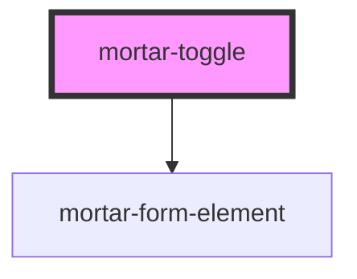

# mortar-toggle

```example
<mortar-toggle label="Available" name="availablity"></mortar-toggle>
```

<!-- Auto Generated Below -->


## Properties

| Property            | Attribute           | Description | Type      | Default    |
| ------------------- | ------------------- | ----------- | --------- | ---------- |
| `checked`           | `checked`           |             | `boolean` | `false`    |
| `disabled`          | `disabled`          |             | `boolean` | `false`    |
| `error`             | `error`             |             | `string`  | `''`       |
| `haserror`          | `haserror`          |             | `boolean` | `false`    |
| `label`             | `label`             |             | `string`  | `''`       |
| `name`              | `name`              |             | `string`  | `'toggle'` |
| `required`          | `required`          |             | `boolean` | `false`    |
| `screenreaderlabel` | `screenreaderlabel` |             | `boolean` | `false`    |
| `size`              | `size`              |             | `string`  | `'md'`     |


## Dependencies

### Depends on

- [mortar-form-element](../mortar-form-element)

### Graph


----------------------------------------------


